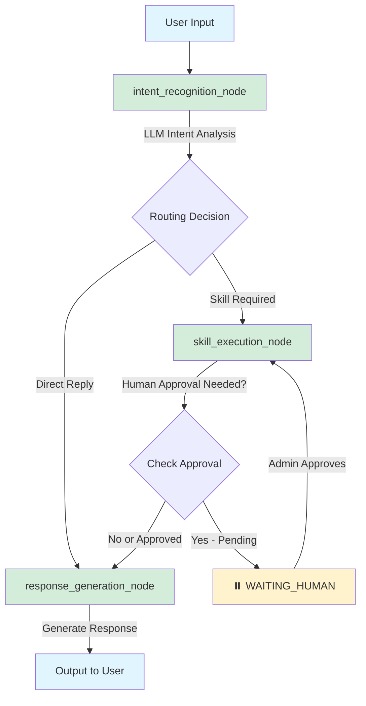

# LangGraph Enterprise Agent Platform

An enterprise-level Agent platform based on LangGraph, supporting stateful workflow orchestration, Control-M job management, Playwright web automation, and more.

## 📁 Project Structure

```
chatbot/
├── app/
│   ├── api/
│   │   └── main.py           # FastAPI entry point, RESTful API + streaming endpoints
│   ├── cli.py                # Command-line interaction entry point
│   ├── config/
│   │   └── settings.py       # Pydantic Settings configuration management
│   ├── graph/
│   │   ├── graph.py          # StateGraph construction and Checkpointer configuration
│   │   ├── nodes.py          # Workflow nodes (intent recognition, skill execution, response generation)
│   │   └── routing.py        # Conditional routing functions
│   ├── llm/
│   │   └── adapter.py        # LLM adapter layer, wraps company AI platform calls
│   ├── monitoring/
│   │   ├── logger.py         # Structured logging (structlog/standard library)
│   │   └── metrics.py        # Prometheus monitoring metrics
│   ├── persistence/          # Extension: custom persistence logic
│   ├── skills/
│   │   ├── base.py           # BaseSkill base class + SkillRegistry
│   │   ├── controlm_skill.py # Control-M job scheduling skill
│   │   ├── playwright_skill.py # Playwright web automation skill
│   │   ├── rag_skill.py      # RAG knowledge base search skill (requires API configuration)
│   │   └── wiki_skill.py     # LLM Wiki structured knowledge query skill (works locally or with API)
│   ├── wiki/
│   │   ├── __init__.py       # Wiki module initialization
│   │   ├── engine.py         # Local wiki engine with file-based storage
│   │   └── sample_data.py    # Sample wiki articles for demonstration
│   └── state/
│       └── agent_state.py    # AgentState workflow state definition
├── tests/
│   ├── unit/
│   │   ├── test_state.py
│   │   ├── test_skills.py
│   │   ├── test_rag_skill.py
│   │   └── test_wiki_skill.py
│   └── integration/
├── docs/
├── scripts/
├── main.py                   # Service startup entry point
├── requirements.txt
├── .env.example
└── README.md
```

## 🚀 Quick Start

### 1. Install Dependencies

```bash
cd E:\python\chatbot
pip install -r requirements.txt

# Install Playwright browsers (if web automation is needed)
playwright install chromium
```

### 2. Configure Environment Variables

```bash
copy .env.example .env
# Edit .env and fill in your company AI platform URL and API Key
```

### 3. Start API Service

```bash
python main.py
# Visit http://localhost:8000/api/v1/docs to view Swagger documentation
```

### 4. Command-Line Usage

```bash
# Single conversation
python -m app.cli chat "Check the status of Control-M job DailyReport"

# Streaming output
python -m app.cli chat "Take a screenshot of Baidu homepage" --stream

# Interactive mode
python -m app.cli interactive

# List registered skills
python -m app.cli skills
```

### 5. Run Tests

```bash
pytest tests/ -v --cov=app
```

## 🏗️ Architecture Overview

### Workflow Nodes



**Node Descriptions:**

| Node | Responsibility |
|------|---------------|
| **intent_recognition_node** | Calls LLM to analyze user intent and determine routing strategy |
| **skill_execution_node** | Executes registered skills (Control-M, Playwright, RAG, Wiki, etc.) |
| **response_generation_node** | Generates natural language responses using LLM |
| **Human-in-the-Loop** | Pauses workflow for risky operations requiring manual approval |

### Adding New Skills