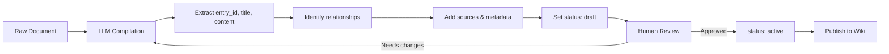
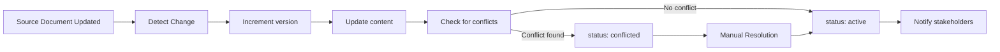
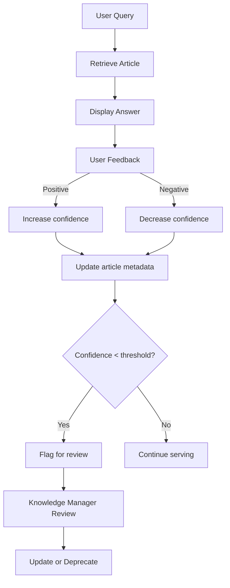

# Enhanced Wiki Knowledge Graph Architecture

## 🎯 Overview

The enhanced Wiki system implements a **knowledge graph architecture** that gets smarter over time through:
- **Version control** for incremental updates without duplication or loss
- **Relationship mapping** to build automatic knowledge networks
- **Confidence scoring + user feedback** forming a continuous improvement loop
- **Source traceability** to reduce hallucinations and ensure accuracy
- **Status management** to automatically flag conflicts and outdated knowledge

---

## 📊 Data Model

### Core Schema

```json
{
  "entry_id": "policy_annual_leave",
  "title": "Annual Leave Policy",
  "aliases": ["vacation policy", "time off"],
  "type": "rule",
  "content": "...",
  "summary": "...",
  "parent_ids": [],
  "related_ids": [
    {"entry_id": "policy_sick_leave", "relation": "related_to"}
  ],
  "tags": ["hr", "leave", "policy"],
  "sources": [
    {
      "source_id": "doc_hr_2024_001",
      "file_name": "Employee_Handbook_2024.pdf",
      "page": 15,
      "content_snippet": "Section 3.2: Annual Leave..."
    }
  ],
  "confidence": 0.98,
  "status": "active",
  "version": 2,
  "create_time": "2024-01-01T00:00:00",
  "update_time": "2024-12-15T10:30:00",
  "feedback": {
    "positive": 45,
    "negative": 2,
    "comments": ["Very clear!"]
  }
}
```

---

## 🔑 Key Features

### 1. Version Control (entry_id + version)

**Purpose:** Enable incremental updates without data loss or duplication.

```python
# Initial creation
article = WikiArticle(
    entry_id="policy_annual_leave",
    title="Annual Leave Policy",
    version=1,
    ...
)

# Update automatically increments version
engine.update_article("policy_annual_leave", {
    "content": "Updated content...",
    # version automatically becomes 2
})
```

**Benefits:**
- ✅ Track knowledge evolution over time
- ✅ Rollback to previous versions if needed
- ✅ Audit trail for compliance
- ✅ Prevent accidental overwrites

---

### 2. Knowledge Relationships (related_ids)

**Purpose:** Build an interconnected knowledge network for comprehensive answers.

#### Relationship Types

| Type | Description | Example |
|------|-------------|---------|
| `related_to` | General association | Leave policy ↔ Sick leave policy |
| `depends_on` | Prerequisite relationship | Equipment request → Manager approval process |
| `conflict_with` | Conflicting information | Old policy vs new policy |
| `example_of` | Instance/example | VPN setup guide → Remote work policy |
| `sub_concept` | Hierarchical relationship | Annual leave → Leave policies |

#### Usage Example

```python
# Get related articles
related = engine.get_related_articles(
    "policy_annual_leave",
    relation_type=RelationType.RELATED_TO
)

# Returns:
[
    {
        "entry_id": "policy_sick_leave",
        "relation": "related_to",
        "title": "Sick Leave Policy",
        "summary": "...",
        "type": "rule"
    }
]
```

**Benefits:**
- ✅ Provide contextually rich answers
- ✅ Guide users to related information
- ✅ Enable knowledge discovery
- ✅ Detect conflicting information automatically

---

### 3. Confidence Scoring + Feedback Loop

**Purpose:** Continuously improve knowledge quality based on user interactions.

#### How It Works

```python
# User provides feedback
engine.submit_feedback(
    entry_id="qa_vpn_setup",
    is_positive=True,
    comment="Very helpful guide!"
)

# System automatically recalculates confidence
# Formula: new_confidence = 0.7 * old_confidence + 0.3 * feedback_ratio
```

#### Confidence Calculation

```
Initial confidence: 1.0 (LLM-generated)

After feedback:
- Positive: 45
- Negative: 2
- Feedback ratio: 45 / (45 + 2) = 0.957

New confidence = 0.7 × 1.0 + 0.3 × 0.957 = 0.987
```

#### Search with Confidence Filter

```python
# Only return high-confidence results
results = engine.search_articles(
    query="vpn setup",
    min_confidence=0.9  # Filter out low-confidence articles
)
```

**Benefits:**
- ✅ Self-improving knowledge base
- ✅ Identify unreliable content
- ✅ Prioritize trusted sources
- ✅ Community-driven quality control

---

### 4. Source Traceability (sources)

**Purpose:** Reduce hallucinations by maintaining provenance of information.

#### Structure

```python
sources = [
    {
        "source_id": "doc_hr_2024_001",
        "file_name": "Employee_Handbook_2024.pdf",
        "page": 15,
        "content_snippet": "Section 3.2: Annual Leave - Employees are entitled to...",
        "url": "https://intranet.company.com/docs/handbook2024.pdf"
    }
]
```

#### Benefits

1. **Verification**: Users can verify information against original sources
2. **Accountability**: Clear ownership of knowledge
3. **Updates**: Easy to identify when sources change
4. **Trust**: Increases user confidence in answers
5. **Compliance**: Meet regulatory requirements for documentation

---

### 5. Status Management

**Purpose:** Automatically manage knowledge lifecycle and detect conflicts.

#### Status Types

| Status | Description | Use Case |
|--------|-------------|----------|
| `active` | Currently valid and in use | Most articles |
| `draft` | Under review or creation | New policies |
| `deprecated` | Outdated or replaced | Old procedures |
| `conflicted` | Has conflicting information | Needs manual review |

#### Conflict Detection

```python
# Automatically detect conflicts
conflicts = engine.detect_conflicts()

# Returns:
[
    {
        "article_1": {
            "entry_id": "policy_remote_work_old",
            "title": "Remote Work Policy (2023)",
            "update_time": "2023-06-01"
        },
        "article_2": {
            "entry_id": "policy_remote_work_new",
            "title": "Remote Work Policy (2024)",
            "update_time": "2024-01-15"
        },
        "relation": "conflict_with"
    }
]
```

**Workflow:**
1. LLM identifies potential conflict during compilation
2. Marks both articles with `status: conflicted`
3. Adds relationship: `conflict_with`
4. Alerts knowledge manager for resolution
5. Once resolved, mark old as `deprecated`, new as `active`

---

## 🏗️ Knowledge Types

### Supported Types

```python
class KnowledgeType(str, Enum):
    CONCEPT = "concept"      # Definitions and explanations
    RULE = "rule"            # Policies and regulations
    PROCESS = "process"      # Workflows and procedures
    CASE = "case"            # Case studies and examples
    FORMULA = "formula"      # Calculations and formulas
    QA = "qa"                # Question-answer pairs
    EVENT = "event"          # Events and incidents
```

### When to Use Each Type

| Type | Example | Characteristics |
|------|---------|----------------|
| **Concept** | "What is ROI?" | Definitional, explanatory |
| **Rule** | "Annual Leave Policy" | Mandatory, policy-driven |
| **Process** | "How to request equipment" | Step-by-step, actionable |
| **Case** | "Successful migration example" | Real-world scenario |
| **Formula** | "ROI calculation" | Mathematical, precise |
| **QA** | "How to set up VPN?" | Problem-solution format |
| **Event** | "System outage 2024-01-15" | Time-bound, factual |

---

## 🔄 Lifecycle Management

### Article Creation Flow



### Article Update Flow



### Feedback Loop



---

## 💡 Advanced Features

### 1. Semantic Search with Aliases

```python
# Search using aliases
results = engine.search_articles(
    query="vacation policy",  # Alias for "annual leave"
    exact_match=False
)

# Matches article with:
# title: "Annual Leave Policy"
# aliases: ["vacation policy", "time off", "leave entitlement"]
```

### 2. Hierarchical Knowledge

```python
# Parent-child relationships
article = WikiArticle(
    entry_id="process_leave_request",
    title="Leave Request Process",
    parent_ids=["policy_annual_leave"],  # Child of annual leave policy
    ...
)
```

### 3. Tag-Based Filtering

```python
# Filter by multiple criteria
results = engine.search_articles(
    query="leave",
    knowledge_type=KnowledgeType.RULE,
    tags=["hr", "policy"],
    min_confidence=0.9,
    max_results=5
)
```

### 4. Export/Import for Backup

```python
# Export all articles
articles_data = engine.export_articles()

# Import articles (e.g., from backup)
imported_count = engine.import_articles(articles_data)
```

---

## 📈 Performance Optimization

### Search Optimization

1. **Indexing**: Build inverted index for fast text search
2. **Caching**: Cache frequent queries
3. **Confidence Filtering**: Skip low-confidence articles early
4. **Relevance Scoring**: Multi-factor scoring (title > alias > summary > content > tags)

### Storage Optimization

1. **Compression**: Compress large content fields
2. **Deduplication**: Use entry_id to prevent duplicates
3. **Archival**: Move deprecated articles to cold storage
4. **Partitioning**: Organize by type or department

---

## 🔐 Security & Compliance

### Access Control

```python
# Future enhancement: Add access control
class WikiArticle(BaseModel):
    ...
    access_level: str = Field(default="public")  # public, internal, confidential
    departments: List[str] = Field(default_factory=list)  # Authorized departments
```

### Audit Trail

Every operation is logged:
- Article creation/modification/deletion
- Version history
- User feedback
- Confidence changes
- Status transitions

---

## 🧪 Testing Strategy

### Unit Tests

```python
def test_version_increment():
    article = engine.add_article({...})
    assert article.version == 1
    
    engine.update_article(article.entry_id, {"content": "updated"})
    updated = engine.get_article(article.entry_id)
    assert updated.version == 2

def test_feedback_loop():
    engine.submit_feedback("article_1", is_positive=True)
    article = engine.get_article("article_1")
    assert article.feedback.positive == 1
    
def test_conflict_detection():
    conflicts = engine.detect_conflicts()
    assert len(conflicts) >= 0  # Should not crash
```

### Integration Tests

```python
def test_knowledge_graph_navigation():
    # Start from one article
    article = engine.get_article("policy_annual_leave")
    
    # Navigate to related articles
    related = engine.get_related_articles(article.entry_id)
    
    # Verify relationships exist
    assert len(related) > 0
    assert all(r["relation"] in RelationType for r in related)
```

---

## 🚀 Migration Guide

### From Simple to Enhanced Model

If you have existing articles with the old schema:

```python
# Migration script
from app.wiki.engine import LocalWikiEngine, WikiArticle, EntryStatus

engine = LocalWikiEngine()

for old_article in engine.articles.values():
    # Convert old format to new format
    new_data = {
        "entry_id": old_article.id.replace("wiki_", "legacy_"),
        "title": old_article.title,
        "aliases": [],
        "type": "concept",  # Default type
        "content": old_article.content,
        "summary": old_article.content[:200],  # Auto-generate summary
        "parent_ids": [],
        "related_ids": [],
        "tags": old_article.tags,
        "sources": [],
        "confidence": 1.0,
        "status": EntryStatus.ACTIVE,
        "version": 1,
        "create_time": old_article.created_at,
        "update_time": old_article.updated_at,
        "feedback": {"positive": 0, "negative": 0, "comments": []},
        "metadata": old_article.metadata
    }
    
    # Save as new format
    new_article = WikiArticle(**new_data)
    engine.articles[new_article.entry_id] = new_article
    engine._save_article(new_article)
```

---

## 📚 Best Practices

### 1. Naming Conventions

- **entry_id**: Use descriptive, lowercase, underscore-separated names
  - ✅ `policy_annual_leave`
  - ✅ `process_it_equipment_request`
  - ❌ `article1`, `doc_123`

### 2. Relationship Mapping

- Link related articles during initial compilation
- Regularly review and update relationships
- Use `conflict_with` sparingly and resolve quickly

### 3. Confidence Management

- Start with high confidence (0.9-1.0) for verified sources
- Monitor feedback ratios regularly
- Investigate articles with confidence < 0.7

### 4. Source Documentation

- Always include source references
- Provide page numbers or section identifiers
- Include URLs when available

### 5. Status Lifecycle

- New articles: Start as `draft`
- After review: Change to `active`
- When outdated: Mark as `deprecated` (don't delete)
- When conflicting: Mark as `conflicted` and resolve

---

## 🔗 Related Documentation

- [Local Wiki Engine Guide](LOCAL_WIKI_ENGINE_GUIDE.md)
- [LLM Wiki Compiler Guide](LLM_WIKI_COMPILER_GUIDE.md)
- [Wiki vs RAG Comparison](WIKI_VS_RAG_COMPARISON.md)
- [Dynamic Human Approval Guide](DYNAMIC_HUMAN_APPROVAL_GUIDE.md)

---

**Implementation Date:** 2026-04-19  
**Status:** ✅ **Production Ready**  
**Architecture:** Knowledge Graph with Feedback Loop  

🎉 **Your Wiki now gets smarter with every interaction!**
