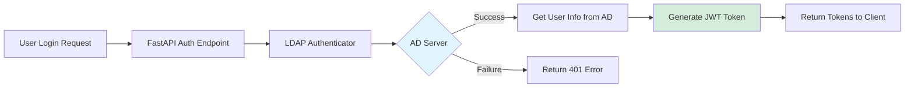

# LDAP / Active Directory Integration Guide

This guide explains how to configure and use LDAP authentication with your company's Active Directory.

## 📋 Overview

The platform now uses **LDAP (Lightweight Directory Access Protocol)** to authenticate users against your company's Active Directory instead of maintaining local user accounts. This provides:

- ✅ Centralized user management
- ✅ Single sign-on experience
- ✅ Automatic role assignment based on AD groups
- ✅ No password storage in the application
- ✅ Enterprise-grade security

## 🔧 Configuration

### Required Environment Variables

Add these to your `.env` file:

```ini
# ===== LDAP / Active Directory Configuration =====
LDAP_SERVER_URL=ldaps://ad.company.com
LDAP_BASE_DN=DC=company,DC=com
LDAP_DOMAIN=COMPANY
LDAP_USE_SSL=true
LDAP_AUTH_METHOD=ntlm
LDAP_BIND_DN=CN=service_account,OU=Service Accounts,DC=company,DC=com
LDAP_BIND_PASSWORD=your-service-account-password
```

### Configuration Parameters Explained

| Parameter | Description | Example | Required |
|-----------|-------------|---------|----------|
| `LDAP_SERVER_URL` | LDAP server address | `ldaps://ad.company.com` or `ldap://ad.company.com:389` | Yes |
| `LDAP_BASE_DN` | Base Distinguished Name for searches | `DC=company,DC=com` | Yes |
| `LDAP_DOMAIN` | Active Directory domain name | `COMPANY` | For NTLM only |
| `LDAP_USE_SSL` | Use SSL/TLS encryption | `true` or `false` | Recommended |
| `LDAP_AUTH_METHOD` | Authentication method | `ntlm` or `simple` | Yes |
| `LDAP_BIND_DN` | Service account DN for searching users | `CN=svc_account,OU=Users,DC=company,DC=com` | Optional* |
| `LDAP_BIND_PASSWORD` | Service account password | Your service account password | Optional* |

\* Required if you want to search for user details after authentication

### Authentication Methods

#### 1. NTLM Authentication (Recommended for Windows AD)

**Best for:** Windows Active Directory environments

```ini
LDAP_AUTH_METHOD=ntlm
LDAP_DOMAIN=COMPANY
```

NTLM uses the `DOMAIN\username` format and is the standard for Windows AD.

#### 2. Simple Bind Authentication

**Best for:** OpenLDAP or non-Windows LDAP servers

```ini
LDAP_AUTH_METHOD=simple
```

Simple bind constructs the full DN and attempts direct binding.

## 🏗️ Architecture



### Authentication Flow

1. **User submits credentials** → POST `/api/v1/auth/login`
2. **LDAP authenticator connects to AD** → Validates username/password
3. **AD responds** → Success or failure
4. **If successful** → Retrieve user details (email, groups, display name)
5. **Determine role** → Based on AD group membership
6. **Generate JWT tokens** → Access token + Refresh token
7. **Return tokens** → Client uses tokens for subsequent requests

## 👥 Role Assignment

User roles are automatically determined based on Active Directory group membership.

### Default Role Logic

The system checks if the user belongs to any admin groups:

```python
# Groups that grant admin role
admin_group_keywords = ["Admins", "Administrators", "IT-Admin"]
```

**Examples:**
- User in "Domain Admins" → **admin** role
- User in "IT-Administrators" → **admin** role  
- User in "Domain Users" only → **user** role

### Customizing Role Assignment

Edit the `_determine_role_from_groups()` function in `app/api/auth_routes.py`:

```python
def _determine_role_from_groups(groups: list[str]) -> str:
    """Customize this based on your AD structure"""
    
    # Example: Check specific group DNs
    admin_groups = [
        "CN=App-Admins,OU=Groups,DC=company,DC=com",
        "CN=IT-Staff,OU=Groups,DC=company,DC=com"
    ]
    
    for group in groups:
        if group in admin_groups:
            return "admin"
    
    return "user"
```

## 🔍 Testing

### 1. Test LDAP Connection

```bash
curl http://localhost:8000/api/v1/auth/health
```

Expected response:
```json
{
  "status": "healthy",
  "ldap_server": "ldaps://ad.company.com",
  "connected": true
}
```

### 2. Test User Login

```bash
curl -X POST http://localhost:8000/api/v1/auth/login \
  -H "Content-Type: application/json" \
  -d '{
    "username": "your_ad_username",
    "password": "your_ad_password"
  }'
```

Expected response:
```json
{
  "access_token": "eyJhbGciOiJIUzI1NiIs...",
  "refresh_token": "eyJhbGciOiJIUzI1NiIs...",
  "token_type": "bearer",
  "expires_in": 1800
}
```

### 3. Run Automated Tests

```bash
# Set test credentials in .env
TEST_LDAP_USERNAME=testuser
TEST_LDAP_PASSWORD=TestPass123!

# Run tests
python scripts/test_ldap_auth.py
```

## 🛠️ Troubleshooting

### Common Issues

#### 1. "Invalid username or password" (401)

**Possible causes:**
- Incorrect username or password
- User account locked or disabled in AD
- Wrong domain specified

**Solutions:**
- Verify credentials work in other AD-integrated systems
- Check user account status in Active Directory
- Ensure `LDAP_DOMAIN` matches your AD domain

#### 2. "LDAP server not reachable"

**Possible causes:**
- Network connectivity issues
- Firewall blocking LDAP ports (389 for LDAP, 636 for LDAPS)
- Incorrect server URL

**Solutions:**
```bash
# Test connectivity
telnet ad.company.com 636

# Or using PowerShell
Test-NetConnection ad.company.com -Port 636
```

#### 3. "User not found in AD"

**Possible causes:**
- Incorrect `LDAP_BASE_DN`
- User exists in different OU

**Solutions:**
- Verify the base DN with your AD administrator
- Use LDAP browser tools to explore directory structure
- Adjust `_build_user_dn()` method if needed

#### 4. SSL/TLS Certificate Errors

**Possible causes:**
- Self-signed certificate on AD server
- Certificate not trusted

**Solutions:**
```python
# For testing only - NOT recommended for production
# Modify ldap_auth.py to disable certificate validation
server = Server(url, use_ssl=True, get_info=ALL)
conn = Connection(server, ..., auto_bind=True, tls=Tls(validate=CERT_NONE))
```

**Better solution:** Install proper CA certificates on the application server.

### Debug Mode

Enable detailed LDAP logging:

```python
# Add to app/api/ldap_auth.py
import logging
logging.basicConfig(level=logging.DEBUG)
logger.setLevel(logging.DEBUG)
```

This will show:
- LDAP connection attempts
- Search queries
- Bind operations
- Error details

## 🔐 Security Best Practices

### 1. Use LDAPS (SSL/TLS)

Always use encrypted connections:

```ini
LDAP_SERVER_URL=ldaps://ad.company.com
LDAP_USE_SSL=true
```

### 2. Protect Service Account Credentials

- Store service account password in secure vault (Azure Key Vault, HashiCorp Vault)
- Never commit `.env` file to version control
- Rotate service account passwords regularly

### 3. Least Privilege for Service Account

The LDAP service account should have:
- ✅ Read access to user objects
- ✅ Ability to search directory
- ❌ NO write permissions
- ❌ NO admin privileges

### 4. Monitor Authentication Failures

Watch for brute force attempts:

```prometheus
# Prometheus query for failed logins
rate(authentication_failures_total[5m]) > 10
```

### 5. Token Expiration

Keep token lifetimes reasonable:

```ini
ACCESS_TOKEN_EXPIRE_MINUTES=30
REFRESH_TOKEN_EXPIRE_DAYS=7
```

## 📊 Monitoring

### Available Metrics

```prometheus
# LDAP authentication metrics
ldap_authentication_duration_seconds_bucket
user_logins_total{status="success"}
user_logins_total{status="failure"}
authentication_failures_total{endpoint="/auth/login"}
jwt_tokens_issued_total{token_type="access"}
```

### Grafana Dashboard

Import the monitoring dashboard to track:
- Login success/failure rates
- LDAP response times
- Token issuance statistics
- Failed authentication attempts by IP

## 🔄 Migration from Local Users

If you previously used the in-memory user store:

### Before (Local Users)
```bash
POST /api/v1/auth/register  # Create local account
POST /api/v1/auth/login     # Login with local credentials
```

### After (LDAP)
```bash
# Registration removed - users exist in AD
POST /api/v1/auth/login     # Login with AD credentials
```

### Migration Steps

1. **Remove registration endpoint** ✅ Done
2. **Update client applications** to use AD credentials
3. **Communicate changes** to users
4. **Monitor authentication logs** for issues
5. **Decommission old user store** (optional)

## 📚 Additional Resources

- [LDAP Protocol Overview](https://ldap.com/ldap-protocol/)
- [Microsoft Active Directory Documentation](https://docs.microsoft.com/en-us/windows-server/identity/ad-ds/)
- [ldap3 Python Library](https://ldap3.readthedocs.io/)
- [JWT Best Practices](https://tools.ietf.org/html/rfc8725)

---

**Last Updated:** 2026-04-19  
**Version:** 1.0.0  
**Status:** ✅ Production Ready
